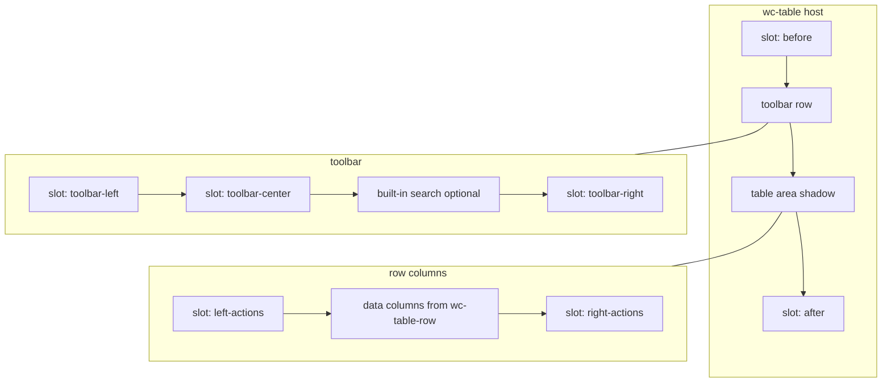

# wc-tables-kit

A flexible, slot-based, and modular **vanilla Web Component table**. No runtime dependencies; works with any framework (or none).

[](https://www.npmjs.com/package/wc-tables-kit)
[](https://github.com/minasvisual/wc-tables/commits/main)
[](https://github.com/minasvisual/wc-tables)

---

## 1. About, Features & Demos

### About

`<wc-table>` is a **shadow-DOM data table** focused on:

- **Slots instead of configuration objects** (toolbar, actions, extra header/footer rows).
- **Plugins** for cell rendering (date, currency, badge, tags, expression, etc.).
- **Progressive enhancement**: works with static HTML + JSON attributes, or fully controlled via JS/React/Angular/Next.

### Key features

- **Rich slots**: `toolbar-left/center/right`, `left-actions`, `right-actions`, `before`, `after`.
- **Formatting plugins**: `date`, `currency`, `badge`, `link`, `image`, `object`, `tags`, `button`, `expression`, `col-filter`.
- **Native column filters**:
  - Declarative `wc-table-head` + `type="col-filter"` renders inputs in an extra header row.
  - Add `column-filters` to `<wc-table>` to enable **built-in client-side column filtering**.
- **Row actions**: buttons with `data-action` per row emit `action-click` with the row payload.
- **Bulk selection**: checkbox column with `row-selected` / `selection-changed` events.
- **Search & filter pipeline**:
  - Built‑in search box (`before-filter` / `after-filter` events).
  - Optional `filter-delay="300"` debounce for built-in search and native column filters.
  - `hide-search` + `filterQuery` property for custom UIs.
- **Client-side pagination** (`page-size`) and standalone `<wc-paginate>` component.
- **Server-side mode** (`server-side`): disables local sort/filter, emits events so your API can drive data.
- **Inline JSON data** via `data='[...]'` in HTML.
- **Hidden columns** with `hidden-cols` (CSV or JSON array).
- **Additional components**: `wc-table-head`, `wc-table-footer`, `wc-paginate`, `Bus` event helper, React adapter.

### Live demos

- **Docs & examples**:  
  `https://minasvisual.github.io/wc-tables/`
- **JsFiddle playground** (CDN):  
  `https://jsfiddle.net/mantovaniartes/bcs9pdyf/4/`

---

## 2. Installation with npm (vanilla JS) + basic example

### Install

```bash
npm install wc-tables-kit
```

### Package exports (subpaths)

| Import | Purpose |
| --- | --- |
| `wc-tables-kit` | Registers `<wc-table>` and related elements. |
| `wc-tables-kit/style.css` | Global stylesheet URL (optional; shadow also loads CSS). |
| `wc-tables-kit/config` | `Config` (language, `registerPlugin`). |
| `wc-tables-kit/bus` | `Bus()` event helper. |
| `wc-tables-kit/react` | `WcTable`, `WcTableRow` React wrappers. |
| `wc-tables-kit/react-column-filters` | `useWcTableColumnFilters` (advanced). |
| `wc-tables-kit/helpers/column-filter` | `tableDataWithEmptyFilterShell`, `emptyFilterPlaceholderRow`. |
| `wc-tables-kit/paginate` | `<wc-paginate>` |
| `wc-tables-kit/wc-table-head` / `wc-tables-kit/wc-table-footer` | Head/footer hosts (if imported separately). |

### Basic usage (HTML + JS)

```html
<wc-table id="myTable" page-size="10">
  <!-- Column configuration (one per key) -->
  <wc-table-row col="created_at" type="date" format="DD MMM, YYYY"></wc-table-row>
  <wc-table-row col="salary" type="currency" format="USD"></wc-table-row>
  <wc-table-row col="status" type="badge"></wc-table-row>

  <!-- Toolbar -->
  <h2 slot="toolbar-left">Users</h2>

  <!-- Row actions -->
  <div slot="right-actions">
    <button data-action="edit">Edit</button>
    <button data-action="delete">Delete</button>
  </div>
</wc-table>

<script type="module">
  import 'wc-tables-kit';

  const table = document.getElementById('myTable');
  table.data = [
    { id: 1, name: 'John Doe', created_at: '2023-01-01', salary: 5000, status: 'Active' },
    { id: 2, name: 'Jane Smith', created_at: '2023-03-10', salary: 7200, status: 'Inactive' },
  ];

  table.addEventListener('action-click', (e) => {
    const { action, item } = e.detail;
    console.log(`Action: ${action}`, item);
  });
</script>
```

---

## 3. Installation with unpkg (CDN) + basic example

### Load from CDN (unpkg)

Pin a version in production; `@latest` is fine for quick tests.

```html
<script
  type="module"
  src="https://unpkg.com/wc-tables-kit@1.0.7/src/wc-table.js"
></script>
```

Optional stylesheet (shadow `<link>` also loads `./wc-table.css` next to the module; override with `stylesheet-url` if your bundler breaks that path):

```html
<link rel="stylesheet" href="https://unpkg.com/wc-tables-kit@1.0.7/src/wc-table.css" />
```

### Minimal HTML‑only table

```html
<wc-table
  data='[{"id":1,"name":"Alice"},{"id":2,"name":"Bob"}]'
  page-size="5"
>
  <wc-table-row col="id"></wc-table-row>
  <wc-table-row col="name"></wc-table-row>
</wc-table>
```

- The `data` attribute must be a valid **JSON array**.
- You can still later override `data` via JavaScript (`table.data = [...]`).

---

## 4. React / Next.js (npm) + basic example

The package ships a small React adapter that wraps `<wc-table>` and `<wc-table-row>`:

### Install

```bash
npm install wc-tables-kit
```

### React component

```jsx
import 'wc-tables-kit';
import { WcTable, WcTableRow } from 'wc-tables-kit/react';

export function UsersTable() {
  const data = [
    { id: 1, name: 'John Doe', status: 'active' },
    { id: 2, name: 'Jane Smith', status: 'inactive' },
  ];

  const handleActionClick = (e) => {
    const { action, item } = e.detail;
    console.log('Action:', action, 'item:', item);
  };

  return (
    <WcTable
      data={data}
      pageSize={5}
      onActionClick={handleActionClick}
      className="my-table"
    >
      <WcTableRow col="name" />
      <WcTableRow col="status" type="badge" />

      <div slot="right-actions">
        <button data-action="edit">Edit</button>
      </div>
    </WcTable>
  );
}
```

### Next.js (App Router)

- Mark the component file with `'use client';`.
- Use the same adapter API as in React.
- For more examples, see `examples/react.html` in this repo.

---

## 5. Plugins (cell types) and attributes

All plugins are registered under the `type` attribute of `<wc-table-row>` or declarative `wc-table-head` rows.

### Built‑in plugins

| Plugin `type` | Attributes | Description |
| --- | --- | --- |
| `date` | `format` | Date formatting. Accepts a locale string (`en-US`, `pt-BR`) or custom token patterns (`DD on MMM, YYYY`). |
| `currency` | `format` | Currency formatting using `Intl.NumberFormat`. Example: `format="USD"`, `format="BRL"`. |
| `badge` | — | Renders the value inside a colored badge. |
| `link` | `label`, `target` | Renders an `<a>` tag. `label` overrides the text; `target="_blank"` etc. |
| `image` | `width`, `height`, `rounded` | Renders an ``; `rounded="true"` makes it circular. |
| `object` | `item` | Accesses nested properties (e.g. `item="city"` on a column whose value is `address`). |
| `tags` | — | Accepts an array or CSV/JSON string and renders chips. |
| `button` | `label`, `action`, `class` | Renders a `<button>` with `data-action`; emits `action-click`. |
| `expression` | `expr` | Interpolates `${field}` patterns using the row object. |
| `col-filter` | `placeholder`, `input-type`, `aria-label` | Renders a `.wc-col-filter-input` in an extra `<thead>` row; emits `column-filter` on input. |

### Example: expression + object plugins

```html
<wc-table id="users">
  <wc-table-row col="company" type="object" item="name"></wc-table-row>
  <wc-table-row
    col="info"
    type="expression"
    expr="${name} (${username})"
  ></wc-table-row>
</wc-table>
```

### Custom plugins

Use the global `Config` registry:

```js
import { Config } from 'wc-tables-kit/config';

class UppercasePlugin {
  static render(value) {
    return String(value ?? '').toUpperCase();
  }
}

Config.registerPlugin('uppercase', UppercasePlugin);
```

Then:

```html
<wc-table-row col="name" type="uppercase"></wc-table-row>
```

---

## 6. Slots (layout map)

`<wc-table>` uses slots heavily. **Light DOM** slot content is styled by your app CSS; the table body lives in **Shadow DOM**.

### ASCII overview

```text
<wc-table>
  [before]  -> slot="before"

  [toolbar]
    ├─ slot="toolbar-left"
    ├─ slot="toolbar-center"
    └─ [search box] + slot="toolbar-right"

  [table]
    ├─ [thead]  (auto header + optional wc-table-head extras)
    ├─ [tbody]  (data rows)
    └─ [tfoot]  (optional wc-table-footer rows)

  [after]   -> slot="after"
```

Plus **row-level actions**:

- `slot="left-actions"`: leftmost column (icons, checkboxes).
- `slot="right-actions"`: rightmost column (“View / Delete”, etc.).

### Mermaid (structural map)



### Slot reference

| Slot name | Rendered location | Typical usage |
| --- | --- | --- |
| `before` | Above the whole table wrapper | Section titles, filters, explanatory text. |
| `after` | Below the whole table wrapper | Secondary actions, legends. |
| `toolbar-left` | Left side of toolbar row | Title, “New” button, tabs. |
| `toolbar-center` | Center of toolbar row | Filters, pill toggles, breadcrumbs. |
| `toolbar-right` | Right side, next to search input | Secondary actions, export buttons. |
| `left-actions` | Before first data column | Row icons, custom row selectors. |
| `right-actions` | After last data column | Row commands: “View / Edit / Delete”. |

---

## 7. Events (API surface) + example

`<wc-table>` emits a set of custom events you can subscribe to:

| Event | `detail` payload | When it fires |
| --- | --- | --- |
| `before-mount` | `{}` | Before the first render. |
| `after-mount` | `{}` | After the first render. |
| `before-filter` | `{ query }` | Right before client filter runs (or when you set `filterQuery`). |
| `after-filter` | `{ results }` | After client filter finishes (`results` is current `_filteredData`). |
| `updated` | `{ data }` | When `data` is changed after first load. |
| `action-click` | `{ action, item, originalEvent }` | When a `[data-action]` button in a row is clicked. |
| `row-selected` | `{ item, isSelected, selectedRows }` | When a row checkbox toggles. |
| `selection-changed` | `{ selectedRows, allSelected }` | When the bulk “Select all” state changes. |
| `sort-changed` | `{ key, direction }` | When the sort header changes (always emitted; in `server-side` you handle sorting yourself). |
| `page-changed` | `{ page, totalPages }` | When current page changes (client-side pagination). |
| `column-filter` | `{ column, value, query, originalEvent }` | On `input` from `.wc-col-filter-input` inside the shadow table. |

### Example: listening to filters + pagination

```js
const table = document.getElementById('myTable');

table.addEventListener('before-filter', (e) => {
  console.log('Filtering by query:', e.detail.query);
});

table.addEventListener('after-filter', (e) => {
  console.log('Filtered results:', e.detail.results);
});

table.addEventListener('page-changed', (e) => {
  const { page, totalPages } = e.detail;
  console.log(`Page ${page} of ${totalPages}`);
});
```

---

## 8. Table attributes (behaviour configuration)

| Attribute | Type | Default | Description |
| --- | --- | --- | --- |
| `data` | JSON string | — | Inline JSON array of rows. If set, used as initial `data` unless you set `.data` first. |
| `page-size` | number | `0` (disabled) | When `> 0`, enables client-side pagination with a built-in paginator. |
| `hidden-cols` | string / JSON | — | CSV (`"id,phone"`) or JSON array (`'["id","phone"]'`) of column keys to hide (data remains). |
| `server-side` | boolean | off | When present, disables local filtering/sorting and uses events (`before-filter`, `sort-changed`, etc.) to let your API drive the rows. |
| `hide-search` | boolean | off | Hides the built-in search box; you can still use `filterQuery` and `before-filter`/`after-filter`. |
| `filter-delay` | number | `0` | Debounce in milliseconds for the built-in search input and native `.wc-col-filter-input` filters. Invalid or negative values fall back to `0`. |
| `column-filters` | boolean | off | When present, `<wc-table>` **applies native client-side column filters** from `.wc-col-filter-input` fields. Still emits `column-filter`. |
| `stylesheet-url` | string | module‑relative | Overrides `import.meta.url`-based CSS path. Useful for bundlers (Vite/Angular) — e.g. `"/wc-tables/wc-table.css"`. |

Other configuration is expressed through:

- `<wc-table-row>` elements (one per column, plus declarative head/footer extras).
- Slots (see above).

---

## 9. Column filters (native vs external helpers)

### Native column filters (recommended)

To let `<wc-table>` handle **column filters internally**:

```html
<wc-table id="t" column-filters>
  <wc-table-row col="name" col-label="Name"></wc-table-row>
  <wc-table-row col="email"></wc-table-row>

  <wc-table-head>
    <wc-table-row col="name" type="col-filter" placeholder="Filter name"></wc-table-row>
    <wc-table-row col="email" type="col-filter" placeholder="Filter email"></wc-table-row>
  </wc-table-head>
</wc-table>
```

- `column-filters` tells the table to:
  - track the current value of each `.wc-col-filter-input`,
  - apply client-side filtering per column (combined with the global search query),
  - keep focus and caret even when the table rerenders.
- You still receive `column-filter` events for analytics or to sync external UIs.

### External helpers (advanced integrations)

If you need **full control** (e.g. React controlled state, custom UX, or shell rows to preserve head when data is empty), use:

- `wc-tables-kit/helpers/column-filter`:
  - `tableDataWithEmptyFilterShell(filteredRows, allRows)`,
  - `emptyFilterPlaceholderRow(sample)`.
- `wc-tables-kit/react-column-filters`:
  - `useWcTableColumnFilters(ref, allRows, filterFn, options)`.

Those helpers are what power the Angular/React audit demos but are **not required** for most use cases now that `column-filters` is built in.

---

## 10. Styling, language & custom plugins

### Styling

- `wc-table` inherits **font** and **text color** from its parent.
- You can style slot content as usual (it lives in the light DOM).

```css
[slot="toolbar-left"] h2 {
  color: #4f46e5;
  font-size: 1.5rem;
  letter-spacing: -0.025em;
}

wc-table {
  margin: 4rem 0;
}
```

To tweak internals, prefer **CSS variables** inside `src/wc-table.css`:

```css
/* inside wc-table.css */
th {
  background: var(--wc-table-header-bg, #f1f5f9);
}
```

You can inject variables from your app:

```css
wc-table {
  --wc-table-header-bg: #020617;
}
```

### Language / i18n

Use `Config` to change internal strings (pagination labels, search placeholder, etc.):

```js
import { Config } from 'wc-tables-kit/config';

Config.setLanguage('en'); // or 'pt-BR', etc.
```

### Custom plugins

As shown above, `Config.registerPlugin(name, class)` lets you extend the available `type` values. This is the recommended way to add domain-specific formatters rather than forking the core.

---

## 11. Additional components & helpers

### `<wc-paginate>` — standalone pagination

- Can be used:
  - by `<wc-table>` internally (client-side `page-size`), or
  - as an independent pagination bar for server-side lists.

Key attributes:

| Attribute | Type | Default | Description |
|---|---|---|---|
| `total` | number | `0` | Total number of records. |
| `page` | number | `1` | Current page (1‑based). |
| `page-size` | number | `10` | Records per page. |
| `delta` | number | `2` | Number of page buttons around the active page. |
| `hide-info` | boolean | — | When present, hides the `X–Y / Z` counter. |

Event:

```js
pg.addEventListener('page-changed', (e) => {
  const { page, totalPages, pageSize } = e.detail;
});
```

### `wc-table-head` / `wc-table-footer`

- Allow **extra header/footer rows** without leaving web components:
  - **Manual**: `<template><tr>...</tr></template>` inside the section.
  - **Declarative**: direct child `<wc-table-row>` elements → they generate a single extra `<tr class="wc-thead-extra">` / footer row.
- Support:
  - `col-label` to override column header text,
  - `header-text` for static cells,
  - any plugin type, e.g. `expression` (resolved from `_filteredData[0]`).

### `Bus` — event helper

`Bus(target, handlers)` registers multiple event listeners and returns a single cleanup function:

```js
import { Bus } from 'wc-tables-kit/bus';

const off = Bus('#myTable', {
  'action-click': (e) => console.log(e.detail.action, e.detail.item),
  'updated': (e) => console.log('data updated', e.detail.data),
});

window.addEventListener('pagehide', off, { once: true });
```

### React helpers

- `wc-tables-kit/react` — adapter components (`WcTable`, `WcTableRow`).
- `wc-tables-kit/react-column-filters` — opinionated `useWcTableColumnFilters` hook for advanced filter UIs.

---

## 12. Server-side usage (API‑driven)

When `server-side` is present:

- Local filtering/sorting is disabled.
- `before-filter`, `sort-changed`, `page-changed` become **signals to your API**.

```html
<wc-table id="usersTable" server-side>
  <!-- columns -->
</wc-table>

<script type="module">
  const table = document.getElementById('usersTable');

  table.addEventListener('before-filter', async (e) => {
    const { query } = e.detail;
    const res = await fetch(`/api/users?search=${encodeURIComponent(query)}`);
    const json = await res.json();
    table.data = json.data;
  });

  table.addEventListener('sort-changed', async (e) => {
    const { key, direction } = e.detail;
    const res = await fetch(`/api/users?sort=${key}&dir=${direction}`);
    const json = await res.json();
    table.data = json.data;
  });
</script>
```

Combine this with `<wc-paginate>` for full server-side paging.

---

## 13. Changelog & GitHub history

This repo does not ship a separate “changelog plugin” package — **GitHub is the changelog UI**. Use these entry points:

| Link | Use for |
| --- | --- |
| [Commits on `main`](https://github.com/minasvisual/wc-tables/commits/main) | Full commit history (what landed and when). |
| [Releases](https://github.com/minasvisual/wc-tables/releases) | Tagged versions and release notes (when published). |
| [Compare branches/tags](https://github.com/minasvisual/wc-tables/compare) | Diff between two versions (e.g. `v1.0.6...v1.0.7`). |

Badges at the top of this README point to **npm** and **recent GitHub activity**. For automation, common options are: [Release Drafter](https://github.com/release-drafter/release-drafter), [conventional-changelog](https://github.com/conventional-changelog/conventional-changelog), or GitHub’s **Generate release notes** when creating a release.

---

## 14. License

MIT
